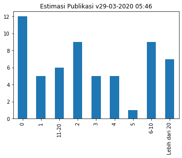
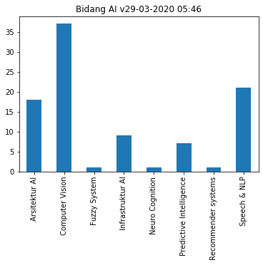
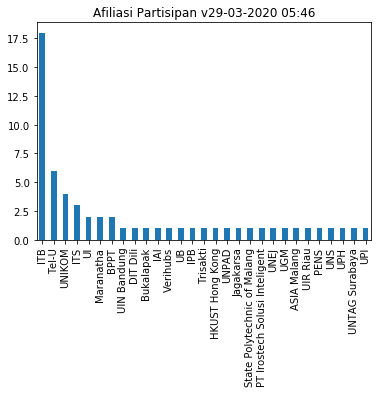
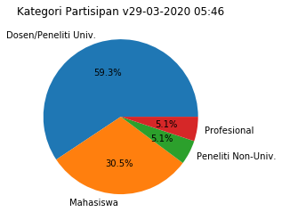
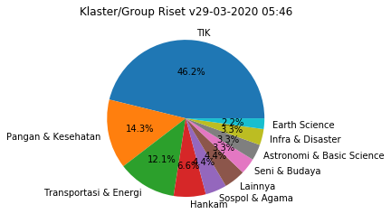

# Survei Aktivitas & Publikasi Riset Artificial Intelligence (AI) di Indonesia

Repo ini berisi beberapa raw data dan seed jupyter notebook untuk survey berikut:

- http://bit.ly/AI-survey2020

Beberapa grafik visualisasi dan data setelah processing sedang disiapkan dan nanti akan dapat di akses melalui alamat
https://eueung.github.io/AI-survey2020 (saat ini BELUM tersedia).

Tujuan dari survey pengumpulan data ini antara lain adalah:
- untuk memperoleh data aktivitas dan publikasi riset tentang AI yang dilakukan oleh lembaga, peneliti, mahasiswa dan profesional di Indonesia.
- apabila partisipasi dan coverage survey cukup luas, data masukan audiens juga akan disosialisasikan kepada komunitas riset/akademik yang terkait dengan AI sehingga dapat konstruktif untuk kebaikan dan kemajuan bersama.

Hasil analisis dan data raw (anonymized) survei ini akan dipublikasikan secara terbuka dan berkala untuk dapat dimanfaatkan semua pihak yg berkepentingan.

## Akses Jupyter Notebook (Google Colab)

- [Data Survey](https://colab.research.google.com/github/eueung/AI-survey2020/blob/master/survey-ai-quickview.ipynb)

## Hasil Sementara (29-03-2020 05:46)

## Data Post-Processing & Web Render (TBA)

Visualisasi lain dan hasil data post-processing dapat dilihat di [TBA](https://eueung.github.io/AI-survey2020/).

## Lisensi

MIT